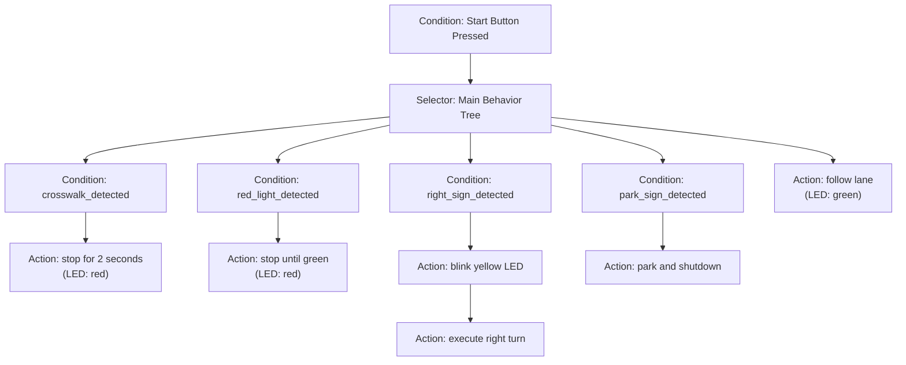

## Self Driving Behavior Tree Flow Chart

```mermaid
graph TD
  Start["Condition: Start Button Pressed"]
  Start --> MainSelector["Selector: Main Behavior Tree"]

  %% Crosswalk Stop
  MainSelector --> CrosswalkCheck["Condition: crosswalk_detected"]
  CrosswalkCheck --> CrosswalkStop["Action: stop for 2 seconds<br>(LED: red)"]

  %% Traffic Light
  MainSelector --> RedLightCheck["Condition: red_light_detected"]
  RedLightCheck --> RedLightWait["Action: stop until green<br>(LED: red)"]

  %% Turn Right
  MainSelector --> RightSignCheck["Condition: right_sign_detected"]
  RightSignCheck --> YellowBlink["Action: blink yellow LED"]
  YellowBlink --> TurnRight["Action: execute right turn"]

  %% Parking
  MainSelector --> ParkSignCheck["Condition: park_sign_detected"]
  ParkSignCheck --> ParkStop["Action: park and shutdown"]

  %% Fallback
  MainSelector --> Follow["Action: follow lane<br>(LED: green)"]
```
