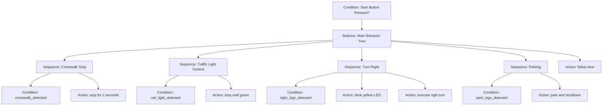

## Self Driving Behavior Tree

```mermaid
graph TD
  Start["Condition: Start Button Pressed?"]
  MainSelector["Selector: Main Behavior Tree"]

  Start --> MainSelector

  %% 1. 횡단보도 처리
  MainSelector --> CrosswalkSeq["Sequence: Crosswalk Stop"]
  CrosswalkSeq --> CrosswalkCond["Condition: crosswalk_detected"]
  CrosswalkSeq --> CrosswalkAction["Action: stop for 2 seconds"]

  %% 2. 신호등 처리
  MainSelector --> LightSeq["Sequence: Traffic Light Control"]
  LightSeq --> RedCond["Condition: red_light_detected"]
  LightSeq --> RedAction["Action: stop until green"]

  %% 3. 우회전 처리
  MainSelector --> TurnSeq["Sequence: Turn Right"]
  TurnSeq --> RightSignCond["Condition: right_sign_detected"]
  TurnSeq --> YellowLed["Action: blink yellow LED"]
  TurnSeq --> TurnAction["Action: execute right turn"]

  %% 4. 주차 처리
  MainSelector --> ParkSeq["Sequence: Parking"]
  ParkSeq --> ParkCond["Condition: park_sign_detected"]
  ParkSeq --> ParkAction["Action: park and shutdown"]

  %% 5. 기본 주행
  MainSelector --> FollowAction["Action: follow lane"]
```
